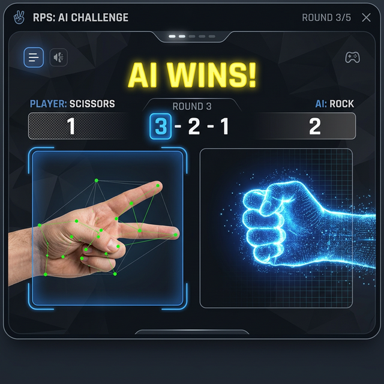

# 🖐️ Real-Time Hand Gesture Recognition System

A high-performance, real-time hand gesture recognition system built using **Python**, **OpenCV**, and **MediaPipe**. This project allows you to recognize custom gestures using Machine Learning and includes a built-in Rock-Paper-Scissors game against an AI.

---

## 🚀 Features
- **Real-Time Hand Tracking**: Detects 21 hand landmarks with high precision using the latest MediaPipe Tasks API.
- **Rule-Based Prediction**: Instantly recognizes Rock, Paper, Scissors, and Thumbs Up.
- **Custom AI Training**: Collect your own data and train a Random Forest model for any gesture.
- **Interactive Game**: Play Rock-Paper-Scissors against the computer with a countdown UI.
- **Human-Computer Interaction (HCI)**: Control your PC's master volume using hand pinch gestures.

---

## 🛠️ Setup & Installation

### 1. Prerequisites
- **Python 3.10 to 3.13**
- A working webcam

### 2. Installation
Clone the repository and set up the virtual environment:

```powershell
# Create virtual environment
python -m venv venv

# Activate virtual environment
.\venv\Scripts\activate

# Install dependencies
pip install opencv-python mediapipe numpy scikit-learn pandas joblib pycaw comtypes
```

---

## 🎮 How to Use

### Step 1: Basic Recognition (No Training Needed)
Run the rule-based recognizer to see 21 landmark points and basic gestures.
```powershell
python src/rule_based_recognition.py
```

### Step 2: Play the RPS Game
Battle the AI in a real-time game! 

- Press **'s'** to start a round (3-second countdown).
- Press **'q'** to quit.
```powershell
python src/rps_game.py
```

### Step 3: Gesture Volume Control (HCI)
Control your Windows system volume with your hand!
- **Pinch fingers together**: Volume Down.
- **Open fingers wide**: Volume Up.
```powershell
python src/gesture_volume_control.py
```

---

## 🧠 Training Your Own AI (Custom Gestures)

Follow these steps to teach the computer new gestures (like "Peace", "Hello", or "Thumbs Down").

### 1. Collect Data
Run the collector and follow the prompts:
```powershell
python src/collect_data.py
```
- **Enter Gesture Name:** Type the name (e.g., `peace`).
- **Record:** Press **'r'** to start/stop recording. Move your hand slightly to get different angles.
- **Target:** Aim for ~500-800 samples per gesture for best accuracy.

### 2. Train the Model
Once you have collected data for all your gestures (saved in `data/gestures.csv`), run the trainer:
```powershell
python src/train_ml_model.py
```
This script uses a **Random Forest Classifier** to learn the geometry of your gestures.

### 3. Real-Time Prediction
Run the final prediction script to see your custom AI in action:
```powershell
python src/ml_prediction.py
```

---

## 📐 How it Works (The Math)
The system extracts **21 landmarks** (x, y coordinates). To make the AI robust, we **normalize** the data by:
1. Translating all points so the **wrist (Point 0)** is at `(0,0)`.
2. This ensures the AI recognizes the gesture regardless of where your hand is in the camera frame.


---

## 📂 Project Structure
- `src/hand_detection.py`: The core engine powered by MediaPipe Tasks API.
- `src/collect_data.py`: Script to save normalized landmark data to CSV.
- `src/train_ml_model.py`: Trains the Scikit-Learn model.
- `src/ml_prediction.py`: Real-time inference logic.
- `src/rps_game.py`: The interactive video game.
- `src/gesture_volume_control.py`: System volume controller using pinch gestures.
- `assets/`: UI images and diagrams.

---

## 📝 Troubleshooting
- **AttributeError: module 'mediapipe' has no attribute 'solutions'**: This project is optimized for Python 3.13 and uses the modern `mp.tasks` API.
- **No such file or directory**: Ensure you are running commands from the project root folder.
- **Camera Not Found**: Ensure no other application (like Zoom) is using your webcam.
